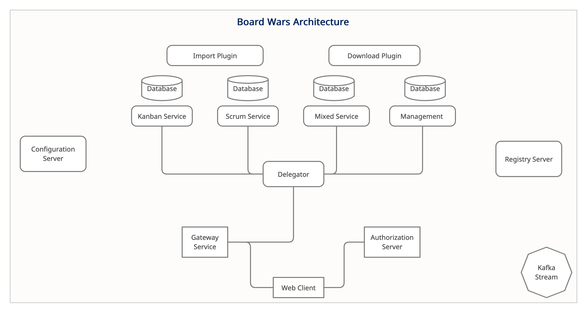

  
<p align="center">    
  <a href="https://github.com/belovedbb/BoardWars" title="Board Wars">    
       
  </a>    
</p>    
<h1 align="center">🌟 Board Wars 🌟</h1>    
    
<p align="center">
    <a href="https://github.com/Belovedbb/Board-wars/graphs/contributors"></a>
    <a href="https://github.com/Belovedbb/Board-wars/network/members"></a>
    <a href="https://github.com/belovedbb/Board-wars/stargazers"></a>
    <a href="https://github.com/belovedbb/Board-wars/issues"></a>
    <a href="https://www.linkedin.com/in/ayooluwa-beloved-65710419a/"></a>
</p> 
    
  <h3 align="center">A Story About Wars</h3>  
  
  <p align="center">  
    A Project Management Tool with a focus on Agile Methodologies, Tracking and Detailed Output.   
    <br />  
    <a href="https://belovedbb.github.io/board-wars-docs/"><strong>🌐 Explore the docs »</strong></a>  
    <br />  
    <br />  
    <a href="assets/Showcase-frontend.md">View Demo</a>  
    ·  
    <a href="https://github.com/belovedbb/Board-wars/issues">Report Bug</a>  
    ·  
    <a href="https://github.com/belovedbb/Board-wars/issues">Request Feature</a>  
  </p>  
</p>  
    
<h2 align="center"></h2>    
  
<!-- TABLE OF CONTENTS -->  
<details open="open">  
  <summary>Table of Contents</summary>  
  <ol>  
    <li>  
      <a href="#🦋about-board-wars">About Board Wars</a>  
      <ul>  
        <li><a href="#👷built-with">Built With</a></li>  
      </ul>  
    </li>  
    <li>  
      <a href="#🚖getting-started">Getting Started</a>  
      <ul>  
        <li><a href="#🔰Back-end">Back-end</a></li>  
        <li><a href="#♻️Front-end">Front-end</a></li>  
      </ul>  
    </li>  
    <li><a href="#🖲️usage">Usage</a></li>  
    <li><a href="#🌏roadmap">Roadmap</a></li>  
    <li><a href="#👥contributing">Contributing</a></li>  
    <li><a href="#📑license">License</a></li>  
    <li><a href="#📞contact">Contact</a></li>  
    <li><a href="#🤝acknowledgements">Acknowledgements</a></li>  
  </ol>  
</details>  
    
  
  
  
<!-- ABOUT THE PROJECT -->  
## 🦋About Board Wars  
Board Wars is a tool which provides Agile based methodologies as a medium of project management, it is highly reactive, uses cloud native patterns for high availability and features  complete API spec for an application development.   It is developed with micro-service architecture in mind thereby facilitating loosely coupled services interacting with themselves.
  
There are many great Project Management tools available, this is just an attempt to produce something fast and cloud native centric while still not losing the benefit of the functionality.  
```  
Note, this is an Experimental Version 1, therefore there are many critical features missing at this point 
```  
##### Benefits:  
* Helps with managing complex projects with different sub tree-like modules/tasks.  
* Can be extremely fast since it makes use of reactive principle  
* Provides detailed overview of projects, tasks of the methodology used.  
##### Architecture:  
  Board wars uses Micro service architecture for interaction between services. It also features cloud native patterns like Circuit Breaker, Bulkhead, Fallback pattern. The following are the key features of Board wars architecture
  *	Microservice Architecture.
  *	Kafka as Message broker for stateless event log.
  *	Hypermedia as the Engine of Application State (**HATEOAS**).
  *	Cloud Native Patterns like Circuit Breaker, Bulkhead Pattern, Rate Limiter, Time Limiter and Fallback Methods.
 <p align="center">    
  <a href="#" title="Board Wars A">    
       
  </a>    
</p>   
  
### 👷Built With  
* [Spring Webflux](https://docs.spring.io/spring-framework/docs/current/reference/html/web-reactive.html)  
* [Angular](https://angular.io/docs)  
  
<!-- GETTING STARTED -->  
##  🚖Getting Started  
After cloning the project from github, docker compose files has been provided for building and starting Board Wars related images, you can run   
```  
docker-compose -f docker-compose.yml -f docker-compose.dev.yml up 
```  
This will build both the back-end and front-end together on docker. If you want to build locally, you need some couple of things in place  
  
### 🔰Back-end  
  
For local builds of board wars, you need   
* Maven  
Install maven (or use IDE provided maven) to clean, build and install the project root modules  
```sh  
 mvn clean install 
```
* Mongo DB  
You need to have mongo db installed on your machine running on port 27017 before you can run the project.  
* Kafka  
### ♻️Front-end
  
* Install or upgrade npm   
```sh  
 npm install npm@latest -g
 ```
cd to the webclient module, specifically at starter folder and install npm packages  
```sh  
 cd /BoardWars/web-client/src/main/starter & npm install 
```
* Run angular front-end
```sh  
 ng serve 
 ```
 Detailed work through of running board wars can be found <a href="#built-with">here</a>  
  
<!-- USAGE EXAMPLES -->  
## 🖲️Usage  
  
_Refer to the [Documentation](https://example.com) for insights about the project._  
* For Example tutorials on how to use board wars, [click here](https://docs.spring.io/spring-framework/docs/current/reference/html/web-reactive.html).  
* For API documentation, [click here](https://docs.spring.io/spring-framework/docs/current/reference/html/web-reactive.html).  
  
<!-- ROADMAP -->  
## 🌏Roadmap  
  
See the [open issues](https://github.com/belovedbb/Board-wars/issues) for a list of proposed features (and known issues).  
  
  
  
<!-- CONTRIBUTING -->  
## 👥Contributing  
Any contributions you make towards the project are **greatly appreciated**.  
  
1. Fork the Project  
2. Create your Feature Branch (`git checkout -b feature/AmazingFeature`)  
3. Commit your Changes (`git commit -m 'Add some AmazingFeature'`)  
4. Push to the Branch (`git push origin feature/AmazingFeature`)  
5. Open a Pull Request  
  
  
  
<!-- LICENSE -->  
## 📑License  
  
Distributed under the MIT License. See `LICENSE` for more information.  
  
  
  
<!-- CONTACT -->  
## 📞Contact  
* [Twitter](https://twitter.com/beloved_johnny)  
* [Linkedin](https://www.linkedin.com/in/ayooluwa-beloved-65710419a)
* [Mail](mailto:belovedbb1@gmail.com)  
* [BoardWars](https://github.com/belovedbb/Board-wars)  
  
  
<!-- ACKNOWLEDGEMENTS -->  
##  🤝Acknowledgements
* [Ngx Admin](https://akveo.github.io/ngx-admin/)  
* [Devstackr](https://www.youtube.com/channel/UCbwsS1m4Hib6R-9F1alus_A)  
* [HighCharts](https://www.highcharts.com/docs/index)  
* [Stack Overflow](https://stackoverflow.com/)
