<h2 align="center">Board Wars Frontend</h3>

<!-- Demo -->
#### ➤ Demo
##### Auth
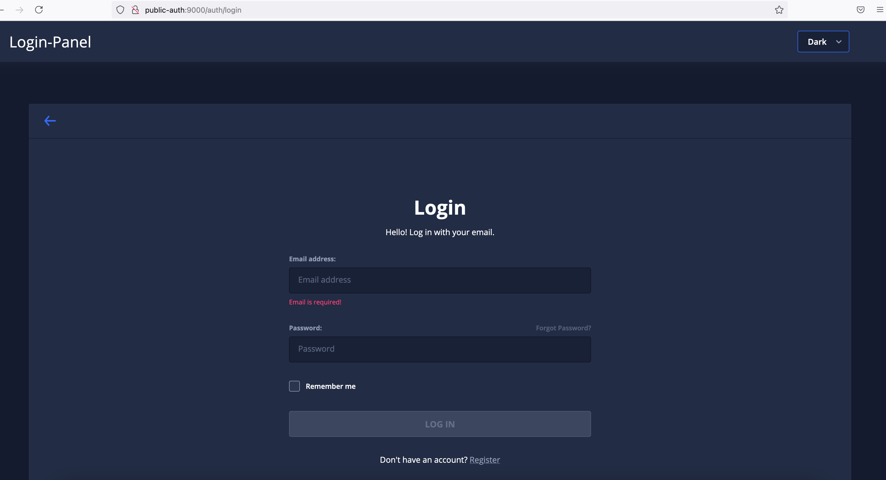
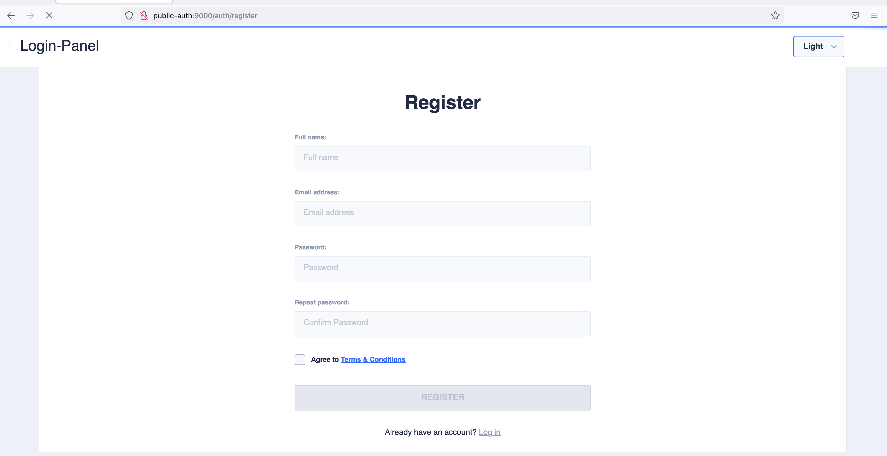
##### Activity
* Dashboard Activity
  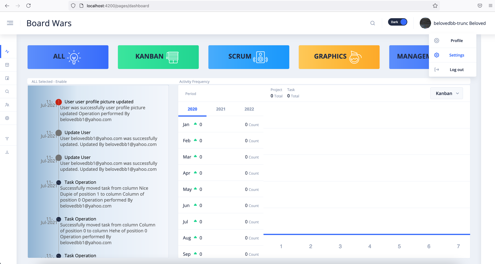
* Dashboard Kanban Tag
  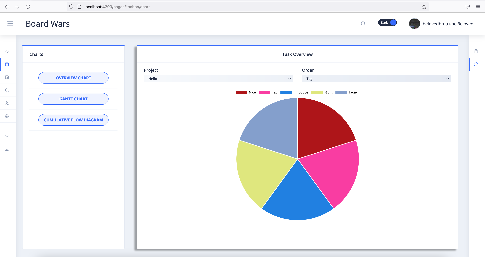
* Dashboard Kanban Column
  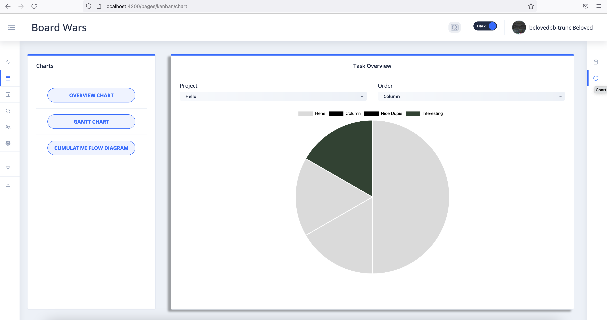
* Dashboard Category
  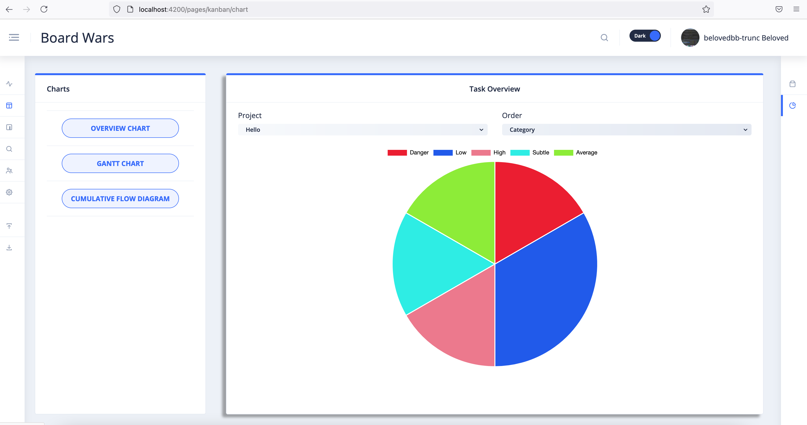
* Dashboard Gantt
  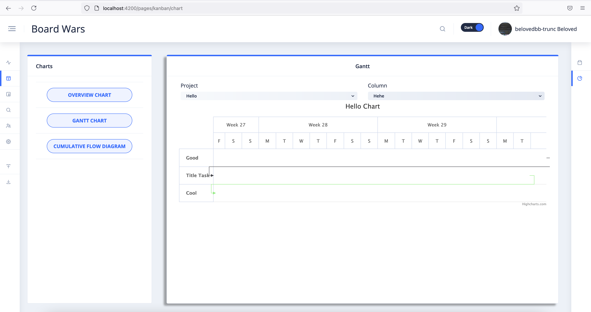
##### Kanban
* Board
  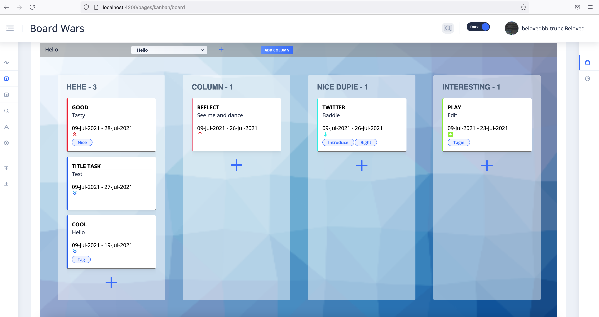
* New Project
  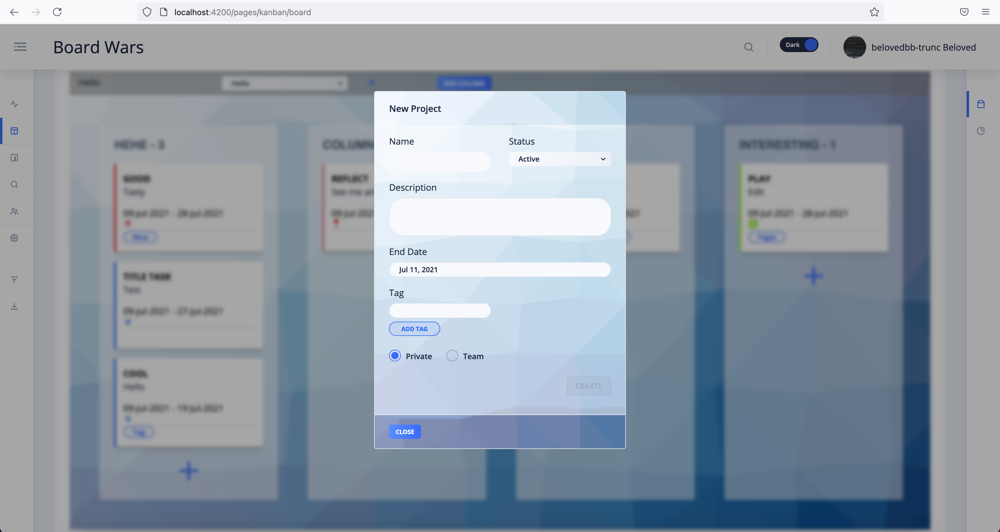
* New Column
  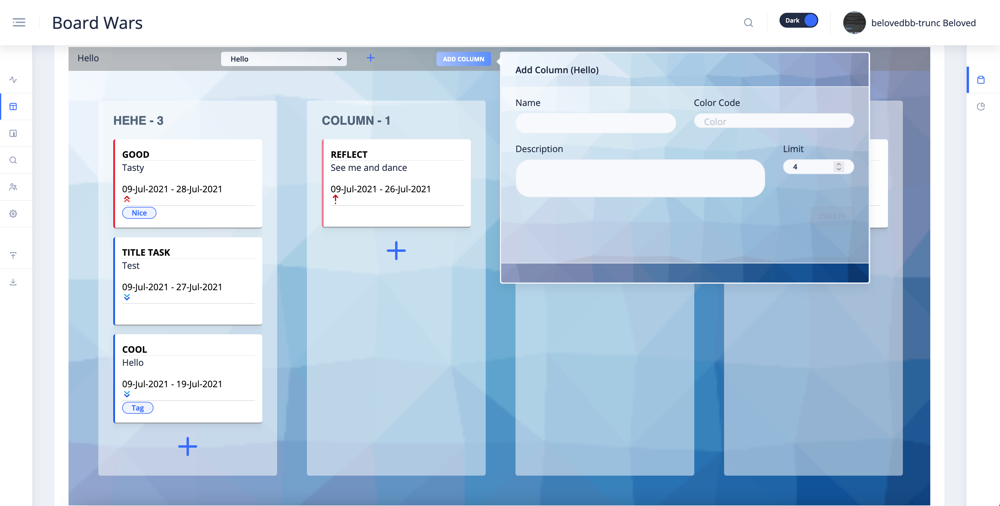
* New Task
  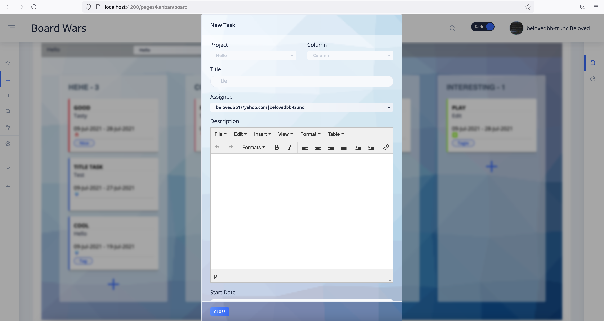
* Task View
  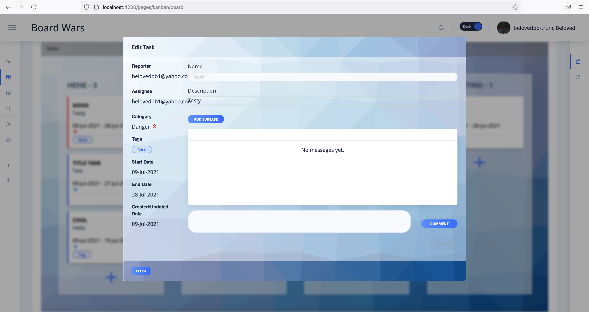
* Task Move
  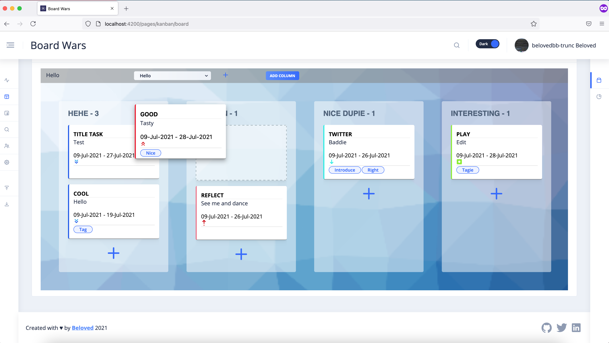
##### Management
* User
  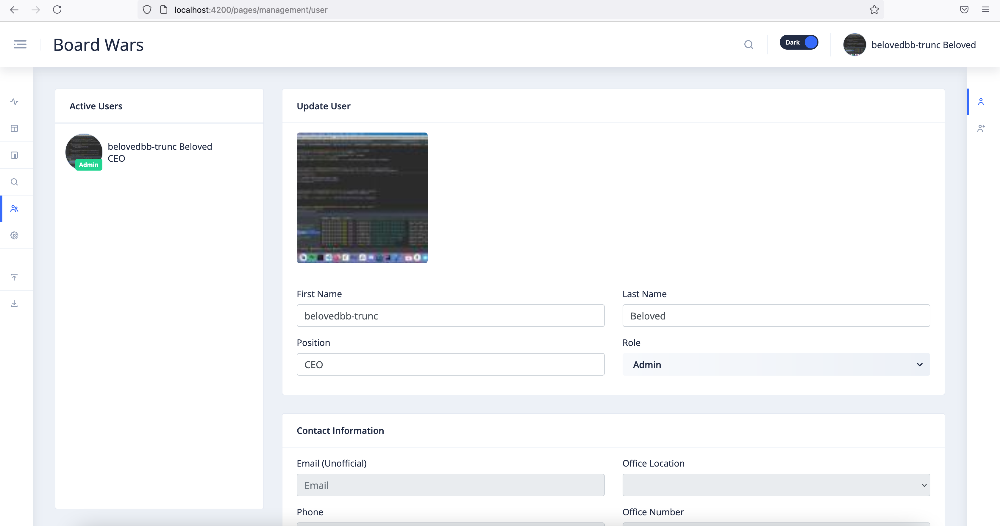
* Team
  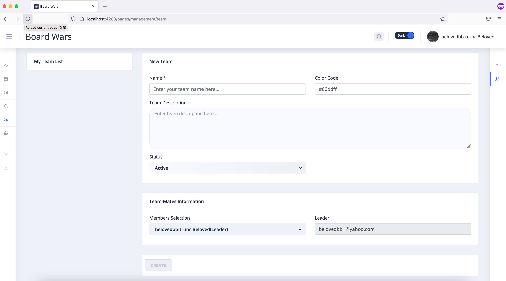
##### Settings
* Kanban 
  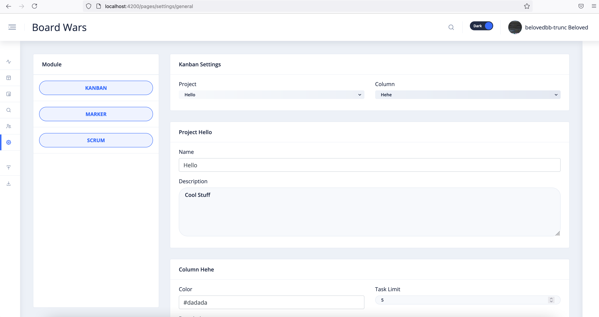
* Marker 
  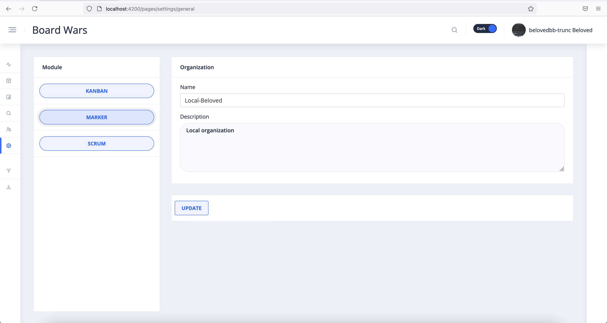
##### Search
* Search
  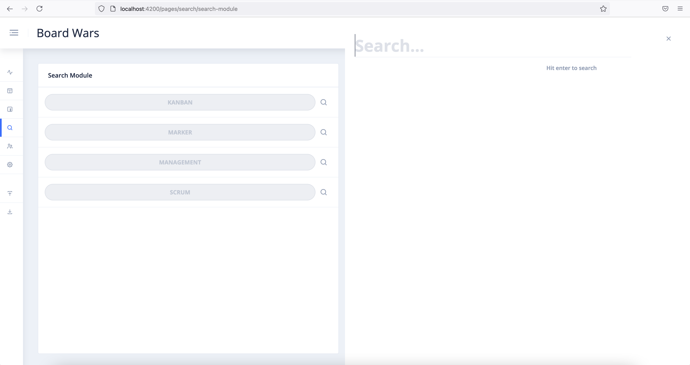
